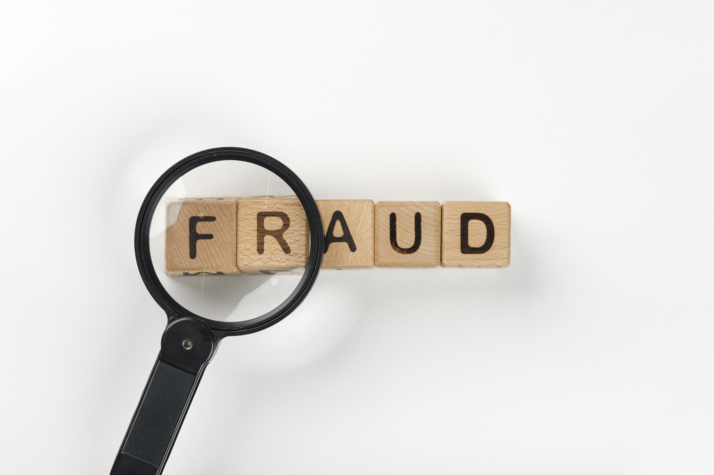

## Portfolio

---

### Fraud Classification

Fraud transactions are invalid transactions, such as a stolen credit card or an illegal payment. These cases can cause a big loss. For this reason, the related parties must know what transactions can be categorized as fraud so that these transactions can be canceled. 
In this project, I use Random Forest and XGboots to classify fraud transactions.

 

 

---
### Customer Segmentation Using RFM

One way to retain customers is increasing customer satisfaction, by providing services following customer expectations and needs. Every customer must have different characteristics so we need to identify the characteristics of each customer and combine them in each group (customer segmentation) to make the right decisions for retaining customers.
In this project, I will use RFM to segment customers.

RFM stands for Recency, Frequency, and Monetary value, each corresponding to some key of customer behavior.
<ul>
  <li> Recency : How recently did the customer purchase? </li>
  <li> Frequency : How often do they purchase? </li>
  <li> Monetary Value : How much do they spend? </li> </ul>

 

 

---
### Market Basket Analysis

Bread Store is a restaurant that sells food and drinks. The increasing number of competitors makes bakeries must continue to innovate. In addition, many products sell very slowly, so their stock builds up. One solution to overcome this problem is to make product packaging that has a strong association (often bought together). We can use the Market Basket Analysis method. 

Example: Customers often buy bread with milk. So, we can make a packet of bread with milk. This strategy can attract customers to buy more than 1 product and can increase revenue.

 

 

---
### Merchant Y Analysis

This is my final assignment from [Anakdata.id](https://anakdata.id/) Course.
 

---

© 2021 Aar Riana. Powered by Jekyll and the Minimal Theme.

<!-- Remove above link if you don't want to attibute -->
